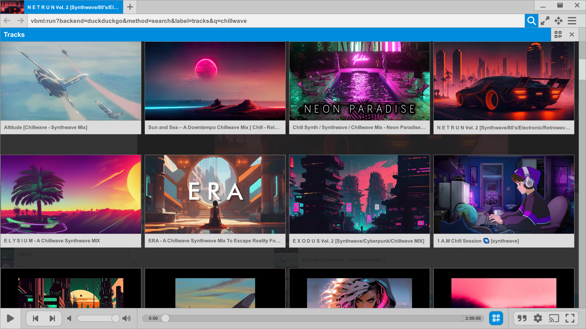

---

[MotionBox](https://omega.gg/MotionBox) is a [Video Browser](https://omega.gg/about/VideoBrowser) built for [Motion Freedom](https://omega.gg/about/MotionFreedom). 
Designed to access, organize and share multiple video resources. 
[omega](https://omega.gg/about) is building MotionBox to empower people. 

## MotionBox Video Browser

MotionBox accesses and aggregates videos via the [VBML](https://omega.gg/VBML) language. 
It supports [DuckDuckGo](https://en.wikipedia.org/wiki/DuckDuckGo),
            [vox](https://omega.gg/vox),
            [BitTorrent](https://en.wikipedia.org/wiki/BitTorrent),
            [TMDB](https://www.themoviedb.org),
            [Youtube](https://en.wikipedia.org/wiki/Youtube),
            [Dailymotion](https://en.wikipedia.org/wiki/Dailymotion),
            [Vimeo](https://en.wikipedia.org/wiki/Vimeo),
            [Twitch](https://en.wikipedia.org/wiki/Twitch_(service)),
            [IPTV(s)](https://github.com/iptv-org/iptv),
            [TikTok](https://en.wikipedia.org/wiki/TikTok),
            [Twitter](https://en.wikipedia.org/wiki/Twitter),
            [Facebook](https://en.wikipedia.org/wiki/Facebook),
            [Odysee](https://en.wikipedia.org/wiki/Odysee),
            [PeerTube](https://en.wikipedia.org/wiki/PeerTube),
            [Last.fm](https://en.wikipedia.org/wiki/Lastfm) and
            [SoundCloud](https://en.wikipedia.org/wiki/SoundCloud). 
All of this inside multiple tabs and without ever showing an ad. 

## For Motion Freedom

- Freedom to access video resources on the Internet.
- Freedom to organize decentralized video sources.
- Freedom to share video content with the world.

## Technology

MotionBox is built in C++ with [Sky kit](https://omega.gg/Sky/sources) on the [Qt framework](https://github.com/qtproject). 
The GUI is powered by QML and rendered with OpenGL. 
The video player is based on [VLC](https://github.com/videolan/vlc) and [libtorrent](https://en.wikipedia.org/wiki/libtorrent). 

## Platforms

- Windows XP and later.
- macOS 64 bit.
- Linux 32 bit and 64 bit.
- Android 32 bit and 64 bit (experimental).

## Requirements

- [Sky](https://omega.gg/Sky/sources) latest version.
- [Qt](https://download.qt.io/official_releases/qt) 4.8.0 / 5.5.0 or later.
- [VLC](https://download.videolan.org/pub/videolan/vlc) 2.2.0 or later.
- [libtorrent](https://github.com/arvidn/libtorrent/releases) 1.1.0 or later.
- [Boost](https://www.boost.org/users/download) 1.55.0 or later.
- [OpenSSL](https://www.openssl.org/source) / [Win32OpenSSL](https://slproweb.com/products/Win32OpenSSL.html) 1.0.1 or later.

On Windows:
- [MinGW](https://sourceforge.net/projects/mingw) or [Git for Windows](https://git-for-windows.github.io) with g++ 4.9.2 or later.

Recommended:
- [Qt Creator](https://download.qt.io/official_releases/qtcreator) 3.6.0 or later.

## Quickstart

You can configure and build MotionBox with a single line:

    sh build.sh <win32 | win64 | macOS | linux | android> all

For instance you would do that for Windows 64 bit:

    * open Git Bash *
    git clone https://github.com/omega-gg/MotionBox.git
    cd MotionBox
    sh build.sh win64 all

That's a convenient way to configure and build everything the first time.

Note: This will create the 3rdparty and Sky folder in the parent directory.

## Building

Alternatively, you can run each step of the build yourself by calling the following scripts:

Install the dependencies:

    sh 3rdparty.sh <win32 | win64 | macOS | linux | android> [all]

Configure the build:

    sh configure.sh <win32 | win64 | macOS | linux | android> [sky | clean]

Build the application:

    sh build.sh <win32 | win64 | macOS | linux | android> [all | deploy | clean]

Deploy the application and its dependencies:

    sh deploy.sh <win32 | win64 | macOS | linux | android> [clean]

## License

Copyright (C) 2015 - 2024 MotionBox authors | https://omega.gg/MotionBox

### Authors

- Benjamin Arnaud aka [bunjee](https://bunjee.me) | <bunjee@omega.gg>

### GNU General Public License Usage

MotionBox may be used under the terms of the GNU General Public License version 3 as published
by the Free Software Foundation and appearing in the LICENSE.md file included in the packaging
of this file. Please review the following information to ensure the GNU General Public License
requirements will be met: https://www.gnu.org/licenses/gpl.html.

### Private License Usage

MotionBox licensees holding valid private licenses may use this file in accordance with the private
license agreement provided with the Software or, alternatively, in accordance with the terms
contained in written agreement between you and MotionBox authors. For further information contact
us at contact@omega.gg.
